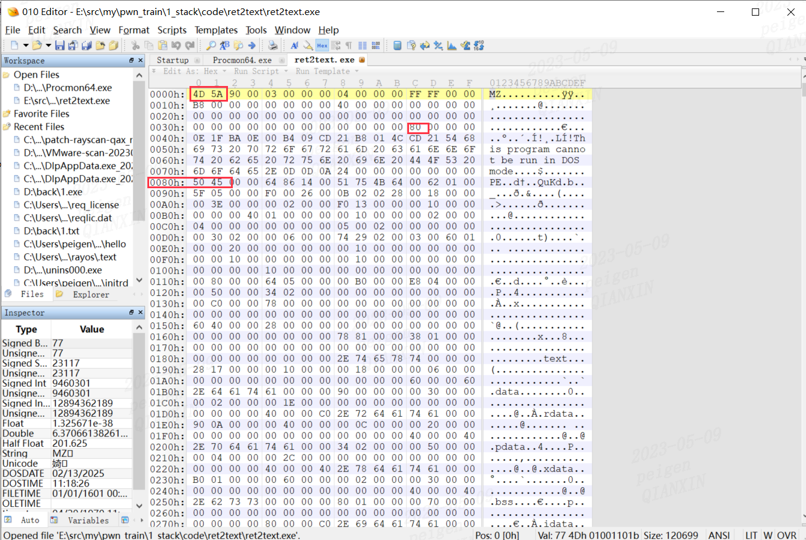
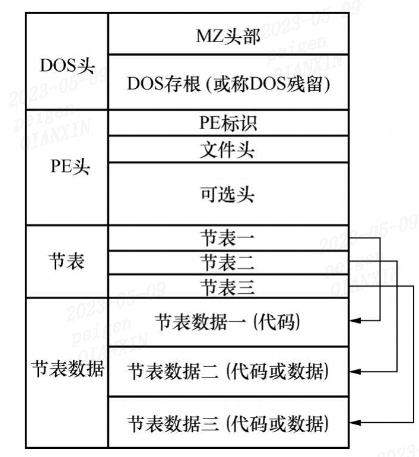
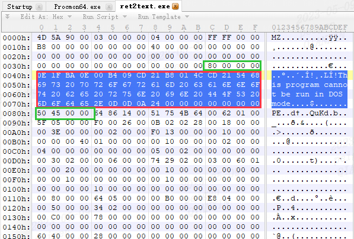
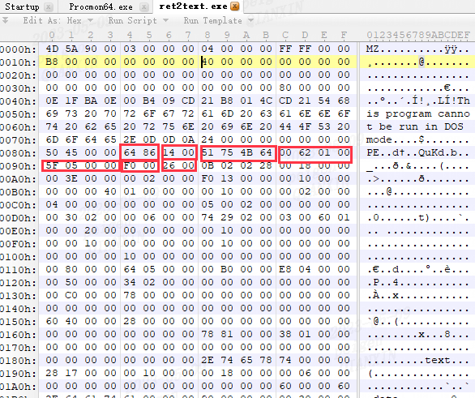

[toc]

# PE

## 可执行文件结构

Windows :PE 
Linux:ELF

同源COFF格式

PE文件特征


## 基本概念
PE文件总体结构如下图


主要4个部分
1. DOS头
2. PE头
3. 节表
4. 节表数据

通常把PE文件分成两层
1. DOS头、PE头和节表属于PE文件的数据管理结构或数据组织结构部分
2. 节表数据才是PE文件真正的数据部分，其中包含着代码、数据、资源等内容

### 基地址

### 虚拟地址
### 相对虚拟地址
### 文件偏移地址


## MS-DOS头部
为什么PE结构的最开始位置有这样一段DOS头部呢？关键是为了该可执行程序可以兼容DOS系统。

由于其开始处的两个字节为“MZ”，因此DOS头也可以叫作MZ头。该部分用于程序在DOS系统下加载，它的结构被定义为IMAGE_DOS_HEADER

结构被定义为IMAGE_DOS_HEADER


``` c
typedef struct _IMAE_DOS_HEADER {       //DOS .EXE header位置  
    WORD e_magic;                       //Magic number;     0x00  
    WORD e_cblp;                        //Bytes on last page of file                         0x02  
    WORD e_cp;                          //Pages in file     0x04  
    WORD e_crlc;                        //Relocations       0x06  
    WORD e_cparhdr;                     //Size of header in paragraphs                       0x08  
    WORD e_minalloc;                    //Minimum extra paragraphs needed                    0x0A  
    WORD e_maxalloc;                    //Maximum extra paragraphs needed                    0x0C  
    WORD e_ss;                          //Initial (relative) SS value                        0x0E  
    WORD e_sp;                          //Initial SP value  0x10  
    WORD e_csum;                        //Checksum          0x12  
    WORD e_ip;                          //Initial IP value  0x14  
    WORD e_cs;                          //Initial (relative) CS value                        0x16  
    WORD e_lfarlc;                      //File address of relocation table                   0x18  
    WORD e_ovno;                        //Overlay number    0x1A  
    WORD e_res[4];                      //Reserved words    0x1C  
    WORD e_oemid;                       //OEM identifier (for e_oeminfo)                     0x24  
    WORD e_oeminfo;                     //OEM information; e_oemid specific                  0x26   
    WORD e_res2[10];                    //Reserved words    0x28  
    LONG e_lfanew;                      //File address of new exe header                     0x3C  
} IMAGE_DOS-HEADER, *PIMAGE_DOS_HEADER;  
```



红圈部分修改不影响程序运行 
在免杀技术、PE文件大小优化等技术中会对该部分进行处理

## PE文件头
PE头部保存着Windows系统加载可执行文件的重要信息


PE头部由**IMAGE_NT_HEADERS**定义。从该结构体的定义名称可以看出，IMAGE_NT_HEADERS由多个结构体组合而成，包括
1. IMAGE_NT_SIGNATRUE
2. IMAGE_FILE_HEADER和
3. IMAGE_OPTIO NAL_HEADER三部分


``` c
typedef struct _IMAGE_NT_HEADERS {
  DWORD                   Signature;
  IMAGE_FILE_HEADER       FileHeader;
  IMAGE_OPTIONAL_HEADER32 OptionalHeader;
} IMAGE_NT_HEADERS32, *PIMAGE_NT_HEADERS32;
```


### Signature字段
将文件标识为 PE 映像的 4 字节签名。 字节为“PE\0\0”。

### IMAGE_FILE_HEADER结构
``` c
typedef struct _IMAGE_FILE_HEADER {
  WORD  Machine;
  WORD  NumberOfSections;
  DWORD TimeDateStamp;
  DWORD PointerToSymbolTable;
  DWORD NumberOfSymbols;
  WORD  SizeOfOptionalHeader;
  WORD  Characteristics;
} IMAGE_FILE_HEADER, *PIMAGE_FILE_HEADER;
# define IMAGE_SIZEOF_FILE_HEADER 20字节
```


**Machine**(2字节)
|Value | 含义|
|--|--|
|IMAGE_FILE_MACHINE_I386 | 0x014c  Intel x86|
|IMAGE_FILE_MACHINE_ALPHA | 0x0184  DEC Alpha|
|IMAGE_FILE_MACHINE_IA64 | 0x0200  Intel Itanium|
|IMAGE_FILE_MACHINE_AMD64 | 0x8664  DEC AlphaX64|

截图中为 DEC AlphaX64

**NumberOfSections**(2字节):

节数。 这指示部分表的大小，该表紧跟在标头之后。Windows 加载程序将分区数限制为 96。
截图中节区 0x0014   20个

**TimeDateStamp**:
链接器创建映像的日期和时间

**NumberOfSymbols**: 如果有COFF 符号表，它代表其中的符号数目，COFF符号是一个大小固定的结构，如果想找到COFF 符号表的结束位置，则需要这个变量。

**SizeOfOptionalHeader**: 紧跟着IMAGE_FILE_HEADER 后边的数据结构（IMAGE_OPTIONAL_HEADER）的大小。(对于32位PE文件，这个值通常是00E0h；对于64位PE32+文件，这个值是00F0h )。

**Characteristics**: 文件属性，有选择的通过几个值可以运算得到。( 这些标志的有效值是定义于 winnt.h 内的 IMAGE_FILE_** 的值，具体含义见下表。
普通的EXE文件这个字段的值一般是 0100h，DLL文件这个字段的值一般是 210Eh。)小甲鱼温馨提示：多种属性可以通过 “或运算” 使得同时拥有！

|Value |-| 含义|
|--|--|--|
|IMAGE_FILE_RELOCS_STRIPPED | 0x0001|  重新定位信息已从文件中删除。 文件必须加载在其首选基址上。 如果基址不可用，则加载程序报告错误|
|IMAGE_FILE_EXECUTABLE_IMAGE | 0x0002|  文件是可执行文件， (没有未解析的外部引用) |
|IMAGE_FILE_LINE_NUMS_STRIPPED | 0x0004|  COFF 行号已从文件中剥离|
|IMAGE_FILE_LOCAL_SYMS_STRIPPED | 0x0008|  COFF 符号表条目已从文件中剥离|
|IMAGE_FILE_AGGRESIVE_WS_TRIM | 0x0010|  积极剪裁工作集。 该值已过时|
|IMAGE_FILE_LARGE_ADDRESS_AWARE | 0x0020|  应用程序可以处理大于 2 GB 的地址|
|IMAGE_FILE_BYTES_REVERSED_LO | 0x0080|  反转单词的字节数。 此标志已过时|
|IMAGE_FILE_32BIT_MACHINE | 0x0100|  计算机支持 32 位单词|
|IMAGE_FILE_DEBUG_STRIPPED | 0x0200|  调试信息已被删除并单独存储在另一个文件中|
|IMAGE_FILE_REMOVABLE_RUN_FROM_SWAP | 0x0400| 如果映像位于可移动媒体上，请将其复制到交换文件并从中运行|
|IMAGE_FILE_NET_RUN_FROM_SWAP | 0x0800|  如果映像位于网络上，请将其复制到交换文件中并从中运行|
|IMAGE_FILE_SYSTEM | 0x1000|  映像是系统文件|
|IMAGE_FILE_DLL | 0x2000|  映像是 DLL 文件。 虽然它是可执行文件，但它不能直接运行|
|IMAGE_FILE_UP_SYSTEM_ONLY | 0x4000|  该文件应仅在单处理器计算机上运行|
|IMAGE_FILE_BYTES_REVERSED_HI | 0x8000|  反转单词的字节数。 此标志已过时|

### IMAGE_OPTIONAL HEADER结构
```
typedef struct _IMAGE_OPTIONAL_HEADER {
  WORD                 Magic;
  BYTE                 MajorLinkerVersion;
  BYTE                 MinorLinkerVersion;
  DWORD                SizeOfCode;
  DWORD                SizeOfInitializedData;
  DWORD                SizeOfUninitializedData;
  DWORD                AddressOfEntryPoint;
  DWORD                BaseOfCode;
  DWORD                BaseOfData;
  DWORD                ImageBase;
  DWORD                SectionAlignment;
  DWORD                FileAlignment;
  WORD                 MajorOperatingSystemVersion;
  WORD                 MinorOperatingSystemVersion;
  WORD                 MajorImageVersion;
  WORD                 MinorImageVersion;
  WORD                 MajorSubsystemVersion;
  WORD                 MinorSubsystemVersion;
  DWORD                Win32VersionValue;
  DWORD                SizeOfImage;
  DWORD                SizeOfHeaders;
  DWORD                CheckSum;
  WORD                 Subsystem;
  WORD                 DllCharacteristics;
  DWORD                SizeOfStackReserve;
  DWORD                SizeOfStackCommit;
  DWORD                SizeOfHeapReserve;
  DWORD                SizeOfHeapCommit;
  DWORD                LoaderFlags;
  DWORD                NumberOfRvaAndSizes;
  IMAGE_DATA_DIRECTORY DataDirectory[IMAGE_NUMBEROF_DIRECTORY_ENTRIES];
} IMAGE_OPTIONAL_HEADER32, *PIMAGE_OPTIONAL_HEADER32;
```

## 节表
程序的组织按照各属性的不同而被保存在不同的节中

描述节表的结构体是IMAGE_SECTION_HEADER，如果PE文件中有N个节，那么节表就是由N个IMAGE_SECTION_HEADER组成的数组


节表中存储了各个节的属性、文件位置、内存位置等相关的信息

## 节表数据
在PE结构中，有几个节表，就对应有几个节表的数据。根据节表的属性、地址等信息，程序的数据就分布在节表指定的位置中

## 区块
### 区块表
### 常见区块表与区块合并
### 区块的对齐值
### 文件便宜与虚拟地址的转换

## 输入表
### 输入函数的调用
### 输入表的结构
### 输入地址表
### 输入表实例
## 绑定输入
## 输出表
### 输入表结构
### 输出表实例分析
## 基址重定位
### 基址重定位的概念
### 基址重定位表的结构
### 基址重定位表实例分析
## 资源
### 资源结构
### 资源实例分析
### 资源编辑工具
## TLS初始化
## 调试目录
## 延迟载入数据
## 程序异常数据
## .NET头部

## 编写PE分析工具